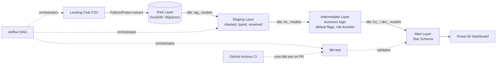
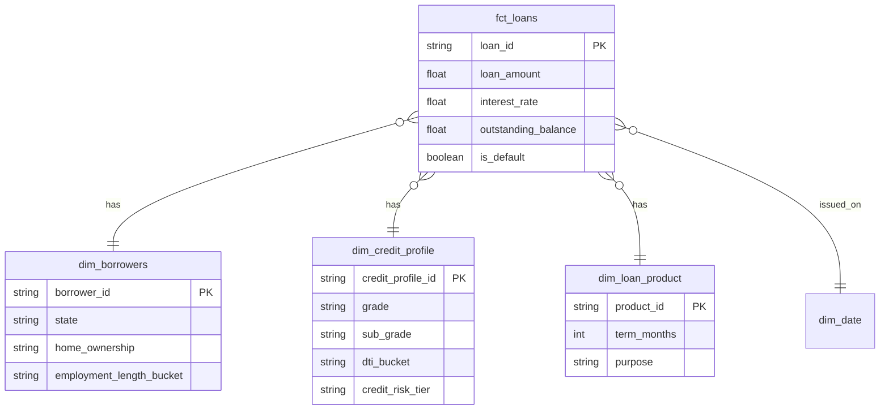

# Credit Risk Analytics Pipeline

An end-to-end analytics engineering pipeline that transforms raw Lending Club loan data into a
Star Schema data mart, with automated data quality tests and a business-facing Power BI dashboard
for credit risk analysis.

## Why this project

During a one-year Data Engineer internship at **Euronext Securities Milan**, I worked on
production ETL pipelines and SQL data models for financial reporting. In a later internship
in Inside Sales at a manufacturing company, I saw first-hand how customer credit limits and
accounts-receivable follow-up work in practice — and how much value there is in turning that
kind of raw operational data into something a risk or finance team can actually act on.

This project rebuilds that workflow end-to-end using a public credit dataset: raw loan records
become a modeled, tested data warehouse, and finally a dashboard that surfaces default risk,
loss estimates, and risk-adjusted return by loan grade.

## Key Finding

Default rate increases monotonically with LendingClub's credit grade, validating both the
maturity-based sampling strategy (see below) and the mart layer's join integrity:

| Grade | Loan Count | Default Rate |
|---|---|---|
| A | 16,756 | 5.72% |
| B | 32,539 | 11.27% |
| C | 25,506 | 18.02% |
| D | 14,714 | 22.17% |
| E | 6,745 | 28.32% |
| F | 3,012 | 33.93% |
| G | 728 | 32.83% |

## Architecture



**Data flow:** extract → raw → staging (clean) → intermediate (business logic) → mart (Star Schema) → BI

## Data Model (Star Schema)



## Tech Stack

| Layer | Tool |
|---|---|
| Extraction | Python (Polars) |
| Storage (dev / prod) | DuckDB (local) / BigQuery (cloud) |
| Transformation | dbt |
| Orchestration | Airflow |
| Data quality | dbt tests (17 tests: schema tests + custom business-rule tests) |
| CI/CD | GitHub Actions |
| Visualization | Power BI |

## Key Design Decisions

- **Maturity-based sampling** — loans need time to reach a terminal status (max term is
  60 months). An initial sample taken from the start of the CSV was recency-biased and produced
  an unrealistic ~0.02% default rate, since most loans were still `Current`. Filtering to loans
  issued 5+ years before the dataset's latest date turned this into a realistic ~15% default rate.
- **Deterministic surrogate keys via hash + row_number** — the source dataset's `id`/`member_id`
  columns are scrubbed for privacy. A hash of several distinguishing columns still produced
  duplicate keys (up to 56 collisions on identical loan terms), which caused a join explosion in
  `fct_loans` when joined against three dimension tables. Adding `row_number() over (partition by
  loan_hash)` into the hash guarantees mathematical uniqueness rather than relying on low
  collision probability.
- **DuckDB for local dev, BigQuery for cloud-scale** — fast iteration locally, same dbt models
  deploy to a cloud warehouse without rewriting SQL.
- **Incremental materialization on `fct_loans`** — avoids full-table reprocessing as new data
  arrives; partitioned/clustered on load in the BigQuery target for query cost efficiency.
- **Credit grade as a risk proxy** — this dataset extract doesn't include FICO score columns, so
  LendingClub's own credit grade (A–G) was used as the risk tier signal instead.
- **Airflow kept intentionally simple** (`extract → dbt run → dbt test`) — time was prioritized
  on data modeling depth over orchestration complexity.
- Full reasoning for these and other trade-offs is documented in
  [`docs/requirements.md`](docs/requirements.md) (project PRD).

## Data Quality

17 dbt tests validate the pipeline on every run:
- **Schema tests**: uniqueness and not-null on primary keys, `accepted_values` on status fields,
  referential integrity (`relationships`) between `fct_loans` and all three dimension tables
- **Custom business-rule tests**: funded amount never exceeds requested loan amount; interest
  rates fall within a realistic range

## Dashboard

The Power BI dashboard surfaces three business-facing views:
- **Portfolio Overview** — loan volume, average rate, issuance trend
- **Risk Segmentation** — default rate by grade / sub-grade / DTI bucket
- **Loss & Return Estimation** — estimated loan loss provision and risk-adjusted return by grade

*(dashboard link / screenshot to be added)*

## How to Reproduce

```bash
git clone https://github.com/gyngwon/credit-risk-pipeline.git
cd credit-risk-pipeline
python -m venv .venv
source .venv/bin/activate          # macOS/Linux
# .venv\Scripts\Activate.ps1       # Windows
pip install -r requirements.txt

# download loan.csv from Kaggle (Lending Club Loan Data) into data/
python extract/load_raw.py

cd dbt_project
dbt deps
dbt run
dbt test
```

## Project Status

- [x] Raw data extraction (DuckDB + BigQuery, maturity-based sampling for realistic default rate)
- [x] Staging layer (`stg_loans`)
- [x] Intermediate layer (loan status flags, employment parsing, credit risk metrics)
- [x] Mart layer (Star Schema: `fct_loans` + 4 dimensions)
- [x] dbt tests (17 tests: uniqueness, referential integrity, custom business rules)
- [ ] Airflow DAG
- [ ] CI/CD (GitHub Actions)
- [ ] Power BI dashboard
